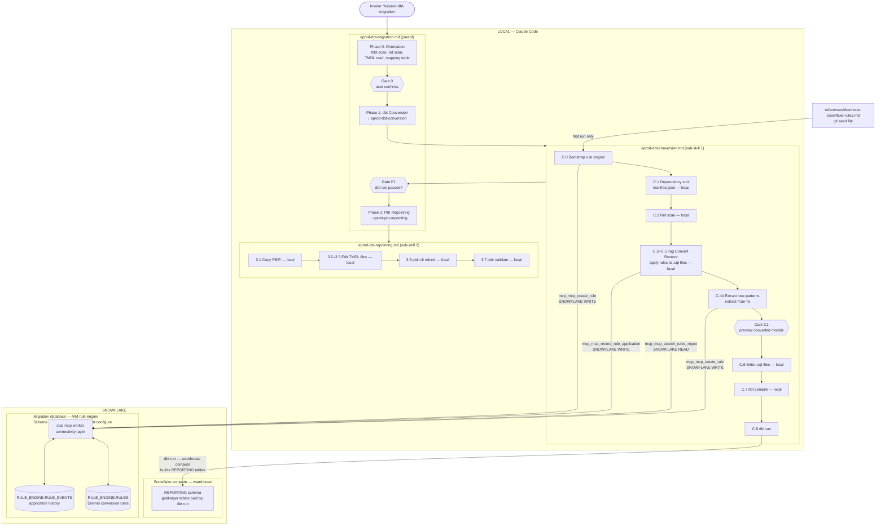

# eprod-dbt-migration

A Claude Code agent that converts EProd's gold-layer dbt models from
Dremio dialect to Snowflake SQL and repoints Power BI PBIP reports.

Maintained by Sam Rahman (Snowflake) in collaboration with EProd and PwC.

---

## What this does

Scope is intentionally narrow:

1. **Gold-layer dbt conversion**: `dbt/models/Marts/` (Dremio dialect) → `dbt_snowflake/models/marts/` (Snowflake dialect)
2. **Power BI repointing**: `.tmdl` M queries → Snowflake native connector

IDMC handles bronze and silver. Oracle ingestion, staging, and Cortex
Analyst YAML generation are out of scope.

Snowflake silver tables are already built by IDMC. The conversion task is
updating the dbt model logic — SQL dialect and source references — so that
gold-layer models rebuild correctly from Snowflake silver rather than Dremio views.

---

## How it works

The agent is a **parent orchestrator** that delegates to two focused sub-skills.
Conversion rules for Dremio-to-Snowflake SQL patterns are stored in the AIM rule
engine in Snowflake (`RULE_ENGINE.RULES`) and applied via a Tag-Convert-Restore
workflow — no automated SnowConvert conversion is run because Dremio is not a
supported SnowConvert source dialect.



> **Where Snowflake is involved:**
> - **Rule engine reads/writes** (Steps C.0, C.4, C.4b): `scai mcp worker` routes MCP tool calls to `RULE_ENGINE.RULES` and `RULE_ENGINE.RULE_EVENTS` in the configured migration database. This is metadata-level — no warehouse compute.
> - **`dbt run` (Step C.8)**: the only step that drives Snowflake warehouse compute. Builds the gold-layer REPORTING tables from Snowflake silver sources. Everything else in the skill runs locally.

---

## How conversion rules work

EProd's Dremio-to-Snowflake conversion rules are stored in `RULE_ENGINE.RULES` —
a Snowflake table in the database you designate for this migration project.
Claude Code searches this table at conversion time and applies matched rules to
each dbt model file.

### Why scai is required (but not for SQL conversion)

`scai` plays two separate roles. It is required for one and explicitly not used for the other:

| Role | Used? | Why |
|---|---|---|
| `scai mcp worker` — Snowflake connectivity | **Yes** | The migration plugin's MCP server routes all database operations (rule engine queries, schema creation) through this subprocess |
| `scai code convert --source <platform>` — SnowConvert conversion | **No** | Dremio is not a supported SnowConvert source dialect. Claude Code applies the rules instead. |

### Where the RULE_ENGINE schema lives

The `RULE_ENGINE` schema **does not exist in any Snowflake database by default**.
It is created automatically the first time the migration plugin's `configure` tool
is called with both `snowflake_connection` and `snowflake_database` parameters.
This call goes through `scai mcp worker` — it is not a plain `CREATE SCHEMA`.

If you check a database where no AIM project has been configured, you will not
find the schema. This is expected.

### Bootstrapping rules on first run

The `eprod-dbt-conversion` sub-skill bootstraps the rule engine on first run from
`references/dremio-to-snowflake-rules.md`. Subsequent runs detect the existing
rules and skip the bootstrap.

### Extract-from-fix: growing the rule set

When the agent finds a pattern during conversion that has no matching rule, it:
1. Fixes the pattern manually
2. Creates a new rule in `RULE_ENGINE.RULES` via `mcp_mcp_create_rule`
3. That rule is available for all remaining models in the same session

Over time this grows EProd's Dremio-specific rule set beyond the initial seed.

### Viewing rules in Snowsight

Once the rule engine is bootstrapped, query it from Snowsight or any Snowflake client.
Replace `<migration_db>` with the database configured for this migration project.

```sql
-- All EProd Dremio conversion rules
SELECT id, name, replacement_mode, category, priority, rule_applications
FROM <migration_db>.RULE_ENGINE.RULES
WHERE source_platforms LIKE '%Dremio%'
ORDER BY priority;

-- Rules applied at least once (effectiveness check)
SELECT id, name, replacement_mode, rule_applications, successes
FROM <migration_db>.RULE_ENGINE.RULES
WHERE source_platforms LIKE '%Dremio%'
  AND rule_applications > 0
ORDER BY rule_applications DESC;

-- Full application history
SELECT r.name, e.code_unit_name, e.outcome, e.context
FROM <migration_db>.RULE_ENGINE.RULE_EVENTS e
JOIN <migration_db>.RULE_ENGINE.RULES r ON e.rule_id = r.id
WHERE r.source_platforms LIKE '%Dremio%'
ORDER BY e.rule_id, e.code_unit_name;

-- Newly extracted rules (from extract-from-fix during conversion)
SELECT id, name, match_pattern, replacement_mode, created_from
FROM <migration_db>.RULE_ENGINE.RULES
WHERE created_from = 'eprod-dbt-migration-extract'
ORDER BY id;
```

### Version control

Two-track approach:

**Track 1 — Git**: `references/dremio-to-snowflake-rules.md` is committed to git
and is the authoritative seed. If the `RULE_ENGINE` schema is dropped or reset,
re-run the conversion sub-skill's bootstrap step (Step C.0) to recreate
everything from this file.

**Track 2 — Snowflake**: The live `RULE_ENGINE.RULES` table grows during migration
as new patterns are extracted. To export enriched rules back to the seed file, run:

```sql
-- Export rules for pasting back into dremio-to-snowflake-rules.md
SELECT name || ' | ' || COALESCE(match_pattern, '') ||
       ' | ' || replacement_mode || ' | ' || COALESCE(description, '') AS export_row
FROM <migration_db>.RULE_ENGINE.RULES
WHERE source_platforms LIKE '%Dremio%'
ORDER BY priority;
```

**Snowflake Time Travel**: Roll back a mistaken rule addition with:

```sql
-- View rules as they were 24 hours ago
SELECT * FROM <migration_db>.RULE_ENGINE.RULES
AT (OFFSET => -60*60*24)
WHERE source_platforms LIKE '%Dremio%';
```

Time Travel provides up to 90 days of history depending on your Snowflake edition.

---

## Prerequisites

Install these before running the agent:

### Required

| Tool | Install | Purpose |
|---|---|---|
| [scai (SnowConvert CLI)](https://docs.snowflake.com/en/developer-guide/snowconvert) | Snowflake docs | AIM rule engine Snowflake connectivity (`scai mcp worker`). Not used for SQL conversion. |
| [fdbt](https://github.com/nicholasgasior/fdbt) | `npm install -g fdbt` | Fast dbt project exploration |
| [dbt](https://docs.getdbt.com/docs/core/installation-overview) | `pip install dbt-snowflake` | Run and compile dbt models |
| [pbir-cli](https://github.com/pbir/pbir-cli) | `npm install -g @pbir/cli` | Power BI field rebinding (Phase 2, conditional) |

### Snowflake connection

Configure a named connection in `~/.snowflake/connections.toml`:

```toml
[connections.eprod-migration]
account   = "myorg-myaccount"
user      = "your_username"
warehouse = "COMPUTE_WH"
database  = "SANDBOX_DB"
schema    = "REPORTING"
```

The agent will ask which connection and which database should host the
`RULE_ENGINE` schema during Gate 0.

---

## Setup

1. Copy all three agent files into your project's agents directory:

   ```bash
   mkdir -p .cortex/agents
   cp eprod-dbt-migration/.cortex/agents/*.md .cortex/agents/
   ```

2. Open Claude Code from your project root (`NaturalGasAssets2`).

---

## Usage

In Claude Code, invoke the parent agent:

```
%eprod-dbt-migration
```

Or describe what you want in natural language:

```
Convert my gold-layer dbt mart models from Dremio to Snowflake
```

The agent runs the prerequisites check first, then walks through each phase
with explicit confirmation gates before taking any action.

### Jumping to a specific phase

```
%eprod-dbt-migration Start at Phase 2 — dbt conversion is done
%eprod-dbt-migration Repoint Power BI reports only
%eprod-dbt-migration Run Phase 0 to rebuild the mapping table
```

---

## Agent files

| File | Purpose |
|---|---|
| `.cortex/agents/eprod-dbt-migration.md` | Parent orchestrator — invoke this one |
| `.cortex/agents/eprod-dbt-conversion.md` | dbt conversion sub-skill (rule engine bootstrap, Tag-Convert-Restore, compile, run) |
| `.cortex/agents/eprod-pbi-repointing.md` | Power BI repointing sub-skill (TMDL edits, pbir-cli) |

## Reference files

| File | Purpose |
|---|---|
| `references/dremio-to-snowflake-rules.md` | SQL conversion rules — git seed for `RULE_ENGINE.RULES` |
| `references/powerbi-repointing-template.md` | M-query before/after templates, TMDL edit instructions |
| `outstanding-questions.md` | Living doc: unresolved ref mappings and manual review items |

---

## Optional companion

The [dbt-labs agent skills](https://github.com/dbt-labs/dbt-agent-skills) include
a `migrating-dbt-project-across-platforms` skill that is complementary to this
agent for general dbt platform migration patterns. Install with:

```bash
/plugin marketplace add dbt-labs/dbt-agent-skills
/plugin install dbt-migration@dbt-agent-marketplace
```

---

## Contributing

- Add new Dremio-specific SQL patterns to `references/dremio-to-snowflake-rules.md`
  (these become the seed for `RULE_ENGINE.RULES` on next bootstrap)
- Add new Power BI edge cases to `references/powerbi-repointing-template.md`
- The three `.cortex/agents/*.md` files are the authoritative workflow

Submit a PR to share improvements across the team.

---

## Contact

Sam Rahman — Snowflake SE  
sam.rahman@snowflake.com
